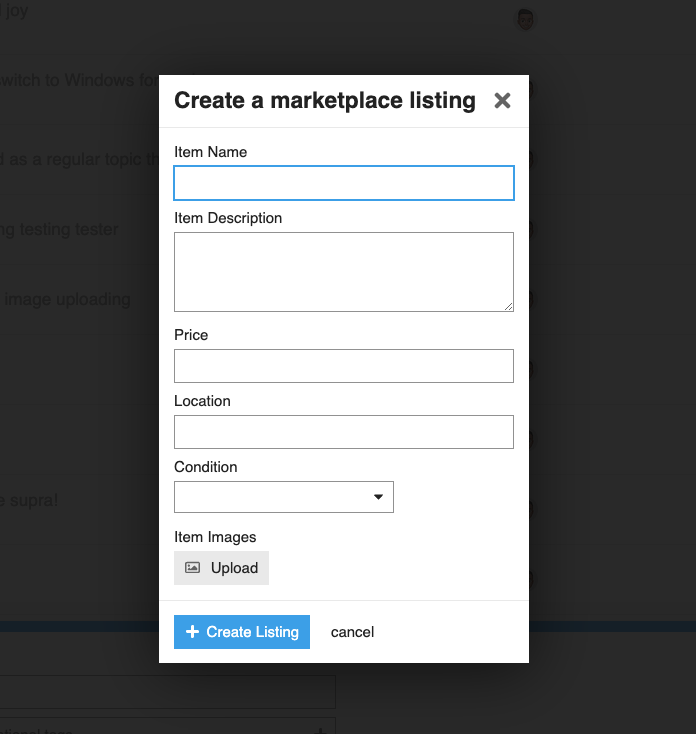
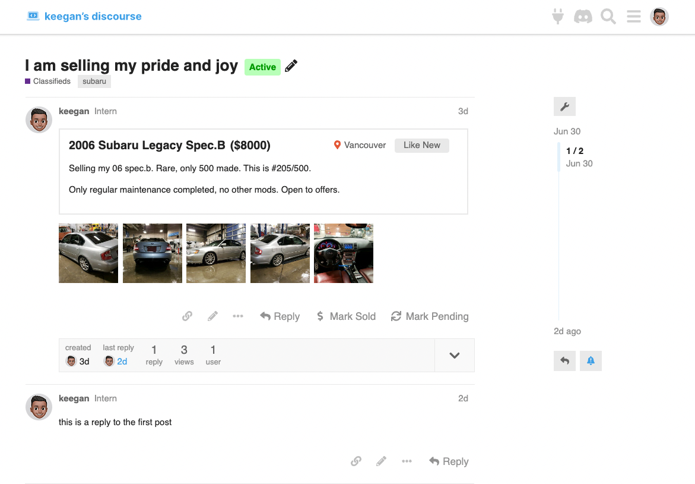
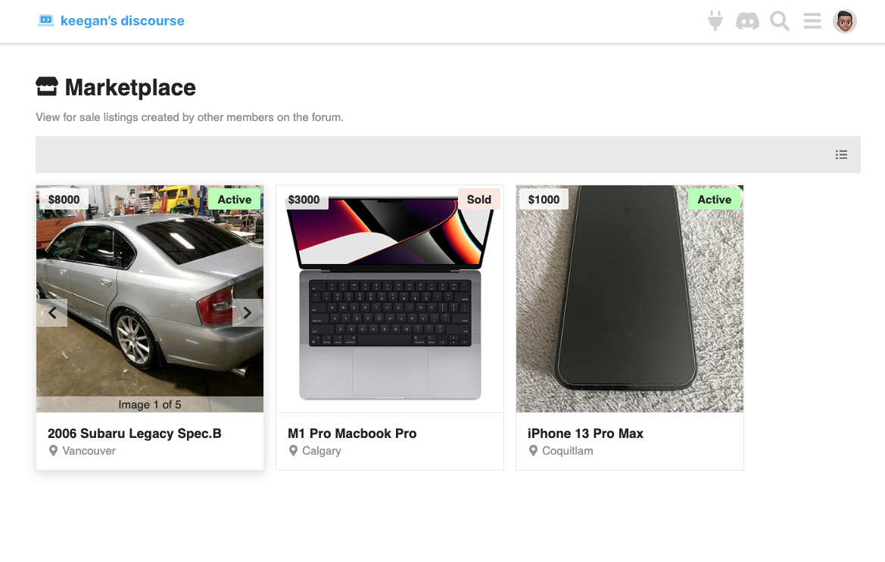

# Discourse Classifieds

A plugin to add a classifieds section/marketplace to your Discourse instance.

> ⚠️ This plugin is still in development and yet to be released.

This project follows [gitmoji](https://gitmoji.dev/) commit conventions.

## Screenshots

Create listings through a modal in the composer:

Topics are decorated based on listing information:

View all forum listings in one place (`/classifieds`):

## Feature To Do List

- [X] Add route showing classified listings in gallery image format
- [X] Ability to create classified listings through a composer button
- [X] Change view style (gallery to list)
- [X] Add a user route to show topic list of listings by user.
- [ ] Ability to sort classified listings by parameters (i.e. status/category)
- [ ] Ability to search through listings (by status/tags/category, etc.)
- [ ] Ability to filter listings by tags, category, and status
- [ ] Use Modern code (i.e. convert to angle brackets things like `{{d-button}}` to `<DButton>`)